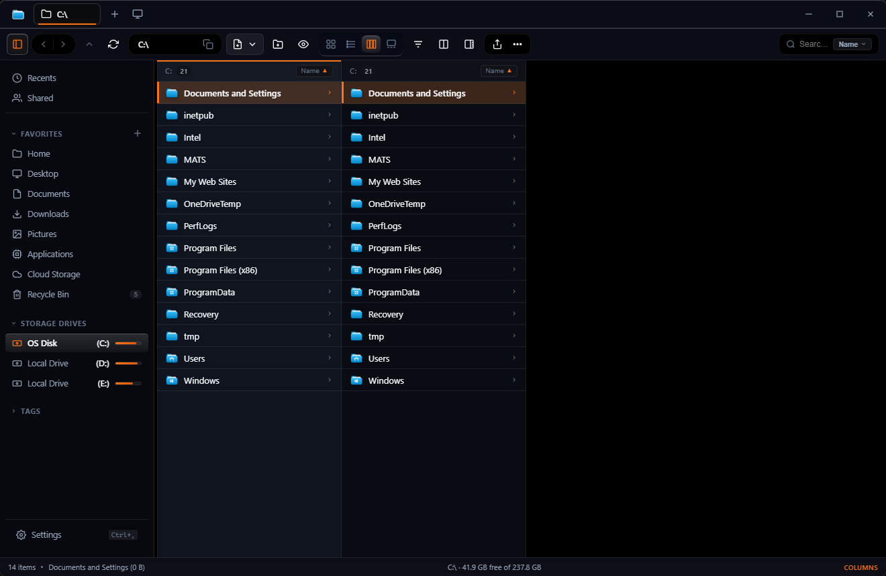
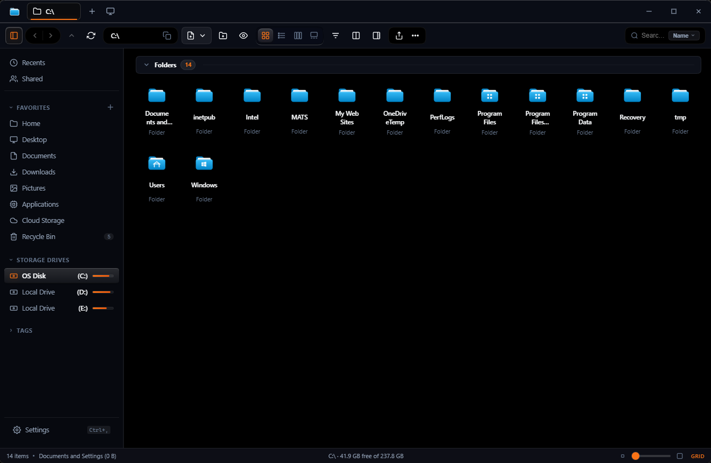
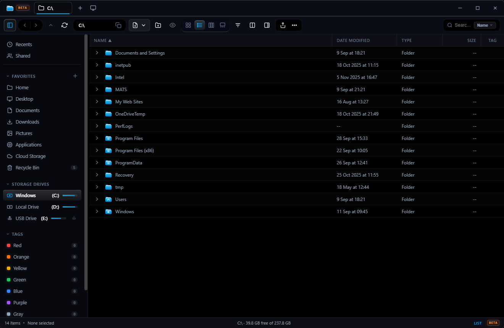
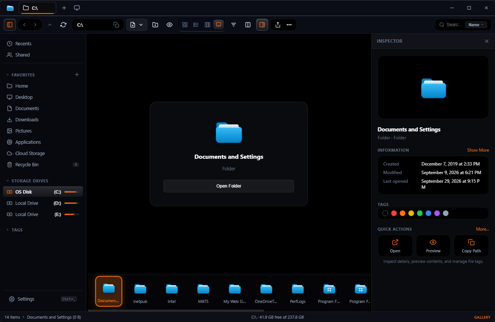
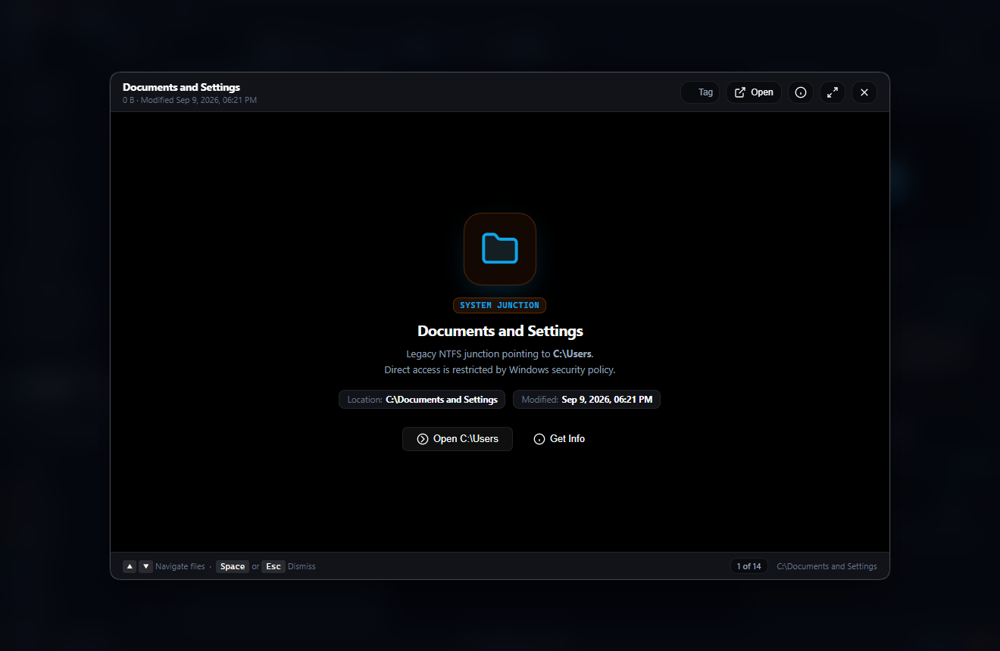
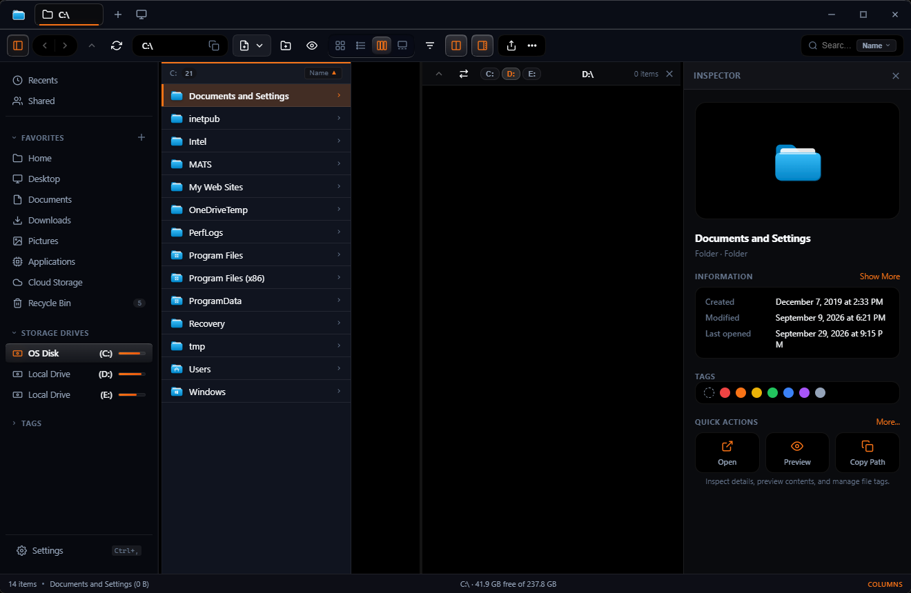
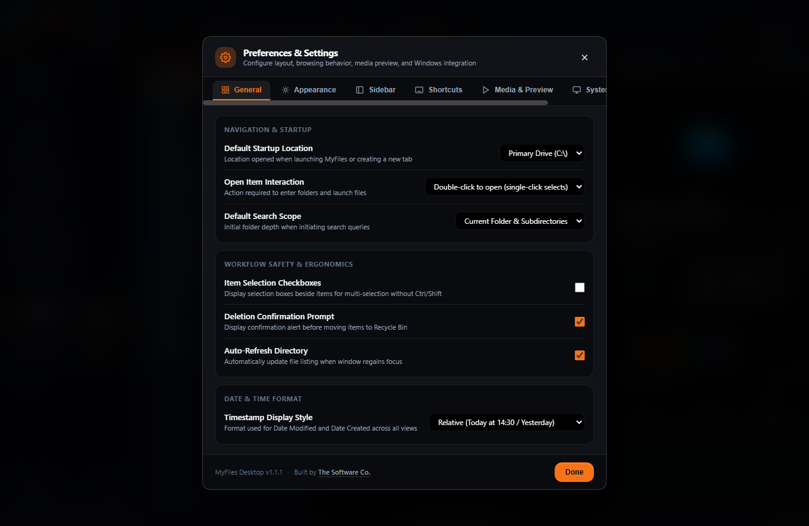

# MyFiles

A fast, keyboard-first Windows file manager built with Node.js and Electron. Combines the best ergonomics of macOS Finder — Quick Look, Miller Columns, and Colored Tags — with the native power of Windows, while resolving the performance bottlenecks, bloat, and layout flaws of both platforms.

<p align="center">
  
</p>

<p align="center">
  <a href="#1-4-finder-view-modes"><strong>4 View Modes</strong></a> •
  <a href="#2-quick-look-preview-engine"><strong>Quick Look</strong></a> •
  <a href="#3-dual-pane-workspace--tab-management"><strong>Dual Pane</strong></a> •
  <a href="#configuration--settings"><strong>Obsidian Settings</strong></a> •
  <a href="https://thesatyamjain.github.io/myfiles/"><strong>Website</strong></a> •
  <a href="CHANGELOG.md"><strong>Changelog</strong></a> •
  <a href="https://github.com/thesatyamjain/myfiles/releases/latest"><strong>Download v1.1.1</strong></a>
</p>

---

## Table of Contents

- [Overview & Philosophy](#overview--philosophy)
- [Feature Comparison Matrix](#feature-comparison-matrix)
- [Interface Anatomy](#interface-anatomy)
- [Core Features Deep-Dive](#core-features-deep-dive)
  - [1. 4 Finder View Modes](#1-4-finder-view-modes)
  - [2. Quick Look Preview Engine](#2-quick-look-preview-engine)
  - [3. Dual-Pane Workspace & Tab Management](#3-dual-pane-workspace--tab-management)
  - [4. macOS Finder Liquid Glass Design System](#4-macos-finder-liquid-glass-design-system)
  - [5. Inspector & Multi-Selection Panel](#5-inspector--multi-selection-panel)
  - [6. Windows Share Hub & Mobile Wi-Fi Transfer](#6-windows-share-hub--mobile-wi-fi-transfer)
  - [7. Storage Health, Treemap & Deduplication](#7-storage-health-treemap--deduplication)
  - [8. PowerRename Batch Tool](#8-powerrename-batch-tool)
  - [9. Recycle Bin & Windows Shell Utilities](#9-recycle-bin--windows-shell-utilities)
- [Advanced Workflow Guides](#advanced-workflow-guides)
- [Architecture & Performance Engineering](#architecture--performance-engineering)
- [Security, Privacy & Sandboxing](#security-privacy--sandboxing)
- [CLI & Command-Line Arguments](#cli--command-line-arguments)
- [REST API Reference (Web Server Mode)](#rest-api-reference-web-server-mode)
- [Configuration & Settings](#configuration--settings)
- [Keyboard Shortcuts Reference](#keyboard-shortcuts-reference)
- [Installation & Getting Started](#installation--getting-started)
- [Building & Releases](#building--releases)
- [Developer Guide & Automated Verification](#developer-guide--automated-verification)
- [Frequently Asked Questions](#frequently-asked-questions)
- [Changelog](CHANGELOG.md)
- [License](#license)

---

## Overview & Philosophy

Modern Windows Explorer has grown increasingly sluggish — burdened by slow shell extension loading, advertising widgets, cloud popups, and a 500 ms+ right-click context menu delay. On the other hand, macOS Finder offers timeless ergonomics (instant Spacebar previews, Miller Columns, colored tag taxonomy), but lacks native Windows productivity strengths: drive letters, an editable path bar, status bar disk gauges, dual-pane file management, and instant "New File" context creation.

**MyFiles** was engineered from first principles to bridge this gap:
- **Zero Frontend Framework Overhead:** Built on clean Vanilla JavaScript and modern CSS tokens — no virtual DOM reconciliation lag or heavy React runtime footprint.
- **Keyboard-First Design:** Every operation (navigation, previewing, searching, splitting, tagging, renaming) can be performed without taking your hands off the keyboard.
- **Dual Runtime Architecture:** Runs as a dedicated native desktop application with Electron 44, or as a standalone zero-install Node.js web server accessible from any browser or mobile phone on your local Wi-Fi.

---

## Feature Comparison Matrix

| Feature | Windows 11 Explorer | macOS Sequoia Finder | MyFiles |
| :--- | :---: | :---: | :---: |
| **Instant Quick Look (`Space`)** | ❌ (Requires Add-ons) | ✅ Native | ✅ **Instant (Multi-format + PDF.js + Code + Archives)** |
| **Miller Columns View** | ❌ No | ✅ Native | ✅ **Native with live preview & horizontal sync** |
| **Dual-Pane Split Workspace** | ❌ No | ❌ No | ✅ **Built-in (`Ctrl+Shift+D`) with drag-and-drop** |
| **Right-Click Context Menu Latency** | ⚠️ 400–800 ms | ⚠️ ~100 ms | ⚡ **Instant (0 ms)** |
| **Editable Address Bar** | ✅ Yes | ❌ Clunky | ✅ **Instant (`Ctrl+L` / `Alt+D` + breadcrumbs)** |
| **Colored Tag Taxonomy** | ❌ No | ✅ Native | ✅ **7-Color Tags with sidebar filters** |
| **Native Archive Inspection** | ⚠️ Partial ZIP | ⚠️ ZIP only | ✅ **ZIP, 7Z, RAR, TAR, GZ, BZ2, XZ, CAB, ISO** |
| **Local Wi-Fi QR Mobile Transfer** | ❌ Cloud only | ⚠️ AirDrop (Apple only) | ✅ **Any Phone (iOS & Android) via Wi-Fi QR** |
| **Cryptographic Deduplication** | ❌ No | ❌ No | ✅ **2-Phase SHA-256 with safe deletion** |
| **Batch PowerRename** | ⚠️ PowerToys only | ⚠️ Basic rename | ✅ **Built-in with regex, variables & live diff** |
| **Disk Treemap & Temp Cleaner** | ❌ No | ❌ No | ✅ **Interactive treemap + %TEMP% cleaner** |
| **Status Bar Disk Gauge** | ❌ Hidden | ❌ Minimal | ✅ **Persistent Free Space / Item / Selection stats** |
| **Browser / Mobile Web Server Mode** | ❌ No | ❌ No | ✅ **Built-in via `server.js` (port 5241)** |
| **Multi-Window Desktop Support** | ✅ Yes | ✅ Yes | ✅ **Built-in (`Ctrl+N` & tab drag-out)** |
| **RAM Footprint (Baseline)** | ⚠️ 250–500 MB | ⚠️ 150–300 MB | ⚡ **120–180 MB** |

---

## Interface Anatomy

```
+----------------------------------------------------------------------------------------------------+
|  [<] [>] [^]  [ C:\Users\hp\Projects\myfiles ]                     [Search... (Ctrl+F)] [_] [□] [X] |
+----------------------------------------------------------------------------------------------------+
|  [Grid] [List] [Cols] [Gallery] | [Zoom -o--] | [New File] [New Folder] [Share] [Dedupe] [Settings] |
+----------------------+-------------------------------------------------------+---------------------+
| QUICK ACCESS         |  PRIMARY VIEWPORT (Grid / List / Columns / Gallery)   | INSPECTOR PANEL     |
|   Recents / Shared   |                                                       |                     |
|   Desktop / Docs     |   [img1.png]      [document.pdf]     [source.js]      |  [Preview Hero]     |
|   Downloads / Videos |   PNG Image       PDF Document       JavaScript       |                     |
|                      |   1920x1080       4 Pages            12.4 KB          |  Filename: img1.png |
| STORAGE DRIVES       |                                                       |  Dimensions: 1920x  |
|   (C:) OS Disk       |   [archive.zip]   [video.mp4]        [notes.md]       |  Size: 2.4 MB       |
|   (D:) Work Disk     |   Zip Archive     MP4 Video          Markdown         |  Kind: PNG Image    |
|                      |   48 Items        1080p · 04:12      2.1 KB           |                     |
| COLORED TAGS         |                                                       |  [Tags: ● Red]      |
|   ● Red   ● Green    |                                                       |                     |
|   ● Blue  ● Orange   |                                                       |  QUICK ACTIONS:     |
|                      |                                                       |  [Preview (Space)]  |
| SYSTEM TOOLS         |                                                       |  [Copy Path]        |
|   Recycle Bin (14)   |                                                       |  [Open App]         |
|   Disk Analyzer      |                                                       |                     |
+----------------------+-------------------------------------------------------+---------------------+
|  Ready | 148 items | 1 selected (2.4 MB) | Free Space: 142.6 GB of 476.2 GB (C:)                   |
+----------------------------------------------------------------------------------------------------+
```

---

## Core Features Deep-Dive

### 1. 4 Finder View Modes

MyFiles provides four primary view modes accessible via toolbar buttons or `Ctrl+1` through `Ctrl+4`:

| View Mode | Shortcut | Description | Ideal Use Case |
| :--- | :--- | :--- | :--- |
| **Grid / Icons** | `Ctrl + 1` | Responsive card layout with dynamic thumbnail scaling and 4-step transmission gear slider. | Photos, media libraries, visual browsing. |
| **List / Details** | `Ctrl + 2` | Dense tabular view with sticky headers, group sorting, and virtual scrolling. | Large directory management, file administration. |
| **Miller Columns** | `Ctrl + 3` | Multi-tier hierarchical browser with horizontal scroll sync and persistent inspector. | Deep directory navigation, codebases. |
| **Gallery View** | `Ctrl + 4` | Large centered media preview with horizontal thumbnail scrubber carousel. | Photo sorting, video review, presentation slides. |

<p align="center">
  
  
</p>
<p align="center">
  
  
</p>

- **Transmission Gear Slider:** 4-step icon zoom control (Small, Medium, Large, Extra Large) with a tactile cogwheel slider thumb that smoothly recalculates grid card sizes.
- **List View Grouping:** Instant group-by engine (by Kind, Date Modified, Size, or Tag) with collapsible group headers that never clip under the sticky column header bar.

---

### 2. Quick Look Preview Engine

Press `Space` on any highlighted file or folder to open the centered Quick Look modal. You can keep Quick Look open while tapping `Arrow Up`, `Arrow Down`, `Arrow Left`, or `Arrow Right` to cycle previews across items instantly.

<p align="center">
  
</p>

#### Supported Format Matrix

| Category | File Extensions | Engine / Capabilities |
| :--- | :--- | :--- |
| **Images** | `.png`, `.jpg`, `.jpeg`, `.webp`, `.gif`, `.svg`, `.bmp`, `.ico`, `.tiff`, `.avif` | Hardware-accelerated canvas/image decoding, 90° rotation, horizontal flip (`H`), zoom controls, and floating glass EXIF HUD (`I`). |
| **Video** | `.mp4`, `.webm`, `.mov`, `.mkv`, `.avi`, `.m4v` | Native streaming via `media-stream://` protocol with HTTP 206 Partial Content byte-range seeking, plus optional VLC direct passthrough. |
| **Audio** | `.mp3`, `.wav`, `.ogg`, `.m4a`, `.flac`, `.aac` | Waveform player card with duration counter and seeking controls. |
| **PDF Documents** | `.pdf` | Bundled self-hosted PDF.js engine with page navigation, dark mode invert, zoom fit, and hand pan tool (`H`). Zero external CDN required. |
| **Office Documents** | `.docx`, `.xlsx`, `.pptx`, `.docm`, `.xlsm` | Fast document metadata extractor and structured text excerpt display. |
| **Code & Data** | `.js`, `.ts`, `.py`, `.rs`, `.go`, `.c`, `.cpp`, `.cs`, `.java`, `.html`, `.css`, `.json`, `.yaml`, `.sql`, `.sh`, `.ps1` | High-performance monospace code preview with line numbers, syntax styling, in-document search (`Ctrl+F`), and copy-to-clipboard. |
| **Markdown** | `.md`, `.markdown` | Rendered HTML preview with headings, fenced code blocks, tables, and lists. |
| **Archives** | `.zip`, `.7z`, `.rar`, `.tar`, `.gz`, `.bz2`, `.xz`, `.cab`, `.iso` | Deep inspection table showing internal file paths, compressed/uncompressed sizes, modification dates, and compression ratio without extracting. |
| **Directories** | Folders & Junction Points | Rich directory inspector displaying item count, subfolder tally, file list table, and one-click "Open Folder" action. |

---

### 3. Dual-Pane Workspace & Tab Management

- **Dual-Pane Split (`Ctrl+Shift+D`):** Divides the main window into two independent, fully featured Explorer viewports separated by an adjustable divider bar.
  - **Cross-Pane Transfers:** Drag items directly from the left pane into the right pane (or vice versa) to copy or move.
  - **Swap Panes (`Ctrl+Shift+S`):** Instantly swap locations between left and right viewports.
  - **Quick Drive Jumpers:** Independent drive dropdowns in each pane header for fast cross-disk operations.
- **Tab Management:** Full browser-style tab bar supporting `Ctrl+T` (new tab), `Ctrl+W` (close tab), middle-click tab close, duplicate tab, and drag-and-drop tab reordering.
- **Multi-Window Desktop Architecture (`Ctrl+N`):** Open independent MyFiles desktop windows with separate folder histories, selection contexts, and IPC channels.

<p align="center">
  
</p>

---

### 4. macOS Finder Liquid Glass Design System

MyFiles implements a tailored design system inspired by the macOS Liquid Glass optical aesthetic:
- **Windows 11 Acrylic Material:** Integrates directly with Windows Desktop Window Manager (DWM) using native acrylic transparency (`backgroundMaterial: 'acrylic'`).
- **Specular Glare Tracking:** A lightweight, rAF-throttled pointer reflection tracker calculates dynamic `--mouse-x` and `--mouse-y` coordinates across modals, buttons, and context menus for realistic optical glare effects.
- **7 Colored Tags:** Tag any file or folder with Red, Orange, Yellow, Green, Blue, Purple, or Gray badges. Filter instantly by clicking any tag in the sidebar.
- **Reduce Transparency Mode:** An accessible high-performance mode toggleable in Settings that strips heavy Gaussian blurs for maximum battery life and frame rates on low-end integrated graphics.

---

### 5. Inspector & Multi-Selection Panel

The right sidebar houses an intelligent Inspector pane that dynamically adapts to your selection:
- **Single Item Inspection:** Displays file hero preview, kind, size, exact pixel dimensions (for images), page counts (for PDFs), word counts (for documents), birth time, modified time, last accessed time, and one-click copyable paths.
- **Multi-Selection Mode:** When multiple items are selected (`Shift` + Click or Marquee drag), the inspector displays a stylized card stack, total selection size, item count badge, and categorized file type breakdown pills (e.g., `4 Images`, `2 Documents`, `1 Archive`).
- **Batch Quick Actions:** Quick Action buttons for Open All, Compress All to ZIP, and Copy All Paths to Clipboard.

---

### 6. Windows Share Hub & Mobile Wi-Fi Transfer

Share files effortlessly across devices without relying on third-party cloud services:
- **Local Wi-Fi QR Code Download:** Generates an instant QR code on your screen. Any phone (iOS / Android) connected to the same Wi-Fi network can scan the code to download the selected file directly to their phone at full local network speed.
- **Quick Links:** Direct one-click share buttons for WhatsApp, Telegram, LocalSend, and Windows Quick Share.
- **App Detection:** Automatically detects installed Windows sharing applications and displays verified desktop badges.

---

### 7. Storage Health, Treemap & Deduplication

- **Disk Treemap Analyzer:** Visualizes disk space distribution with interactive proportional block treemaps to identify large hidden folders.
- **System Temp Cleaner:** Safely scans and calculates reclaimable space across `%TEMP%`, Windows Prefetch, and temporary download caches with one-click cleanup.
- **2-Phase SHA-256 Deduplication Scanner (`dedup.js`):**
  - *Phase 1:* Groups files by exact byte size. Files with unique sizes are skipped immediately (zero disk reading).
  - *Phase 2:* Performs cryptographic SHA-256 hashing only on size-matched candidates to guarantee 100% duplicate accuracy.
  - *Safe Deletion:* Provides duplicate review tables and safe deletion options with Recycle Bin protection.

---

### 8. PowerRename Batch Tool

A built-in batch renaming tool for bulk file organization:
- **Search & Replace:** Simple text matching or standard ECMAScript regular expressions.
- **Pattern Tokens:** Insert dynamic variables including `$name` (original name), `$ext` (extension), `$N` (counter), and `$date` (modification date).
- **Case Transformations:** Convert to UPPERCASE, lowercase, Title Case, or camelCase.
- **Live Preview:** A side-by-side table compares original and new filenames with colorized diffs before committing any changes.

---

### 9. Recycle Bin & Windows Shell Utilities

- **Full Recycle Bin Integration:** Live sidebar badge showing deleted item counts and total space. View deleted items, inspect their original filesystem locations, restore them with one click, or empty the bin securely.
- **Windows Administrative Tools Launcher:** Instant one-click shortcuts to native administrative utilities:
  - Disk Defragmenter & TRIM Optimizer (`dfrgui.exe`)
  - Windows Resource Monitor (`resmon.exe`)
  - Check Disk Utility (`chkdsk.exe`)
  - Storage Spaces Configuration (`control.exe /name Microsoft.StorageSpaces`)
  - Shared Folders Management (`fsmgmt.msc`)
  - Windows File History (`control.exe /name Microsoft.FileHistory`)

---

## Advanced Workflow Guides

### 1. Zero-Cloud Wi-Fi Transfer to Mobile
1. Select any file or video in MyFiles.
2. Click **Share** in the ribbon or right-click and choose **Share Hub**.
3. Point your iPhone or Android camera at the displayed QR Code.
4. Tap the prompt to download the file directly to your phone over your local Wi-Fi router at full network bandwidth (zero internet data used).

### 2. Rapid Multi-Gigabyte Deduplication
1. Navigate to the folder you want to scan (e.g. `D:\Photos`).
2. Click **Deduplicate** in the ribbon.
3. The 2-phase scanner will group files by file size instantly, skipping thousands of non-duplicates without reading disk blocks.
4. Only candidates with identical sizes are verified via cryptographic SHA-256 hashes.
5. Review the duplicate groups and click **Delete Selected** to move copies safely to the Recycle Bin.

### 3. Hardware-Accelerated 4K Video Passthrough
1. Highlight any high-bitrate `.mkv`, `.mp4`, or `.mov` file.
2. Tap `Space` to open Quick Look.
3. For heavy codecs, click the **Play in VLC** button in the Quick Look header to launch instant hardware-accelerated playback with full GPU decoding.

---

## Architecture & Performance Engineering

```
myfiles/
├── main.js                  # Electron main process — window lifecycle, IPC handlers, protocol streams
├── preload.js               # Context-isolated bridge exposing window.myFilesAPI safely
├── server.js                # Standalone Node.js HTTP server (web mode & mobile QR share)
├── fs-engine.js             # Unified filesystem engine — non-blocking statfs, caching, search
├── archive.js               # Archive inspection, extraction, and compression (7-Zip + bsdtar)
├── dedup.js                 # 2-phase SHA-256 duplicate detection engine
├── storage.js               # Storage analytics, temp directory cleaner, Recycle Bin metrics
├── vlc.js                   # VLC media player IPC bindings
├── src/
│   ├── index.html           # Unified DOM layout, modals, context menus, and toolbars
│   ├── styles.css           # Liquid Glass design system, CSS tokens, responsive typography
│   ├── renderer.js          # Core client controller — views, selection, drag & drop, Quick Look
│   └── vendor/
│       └── pdfjs/           # Self-hosted PDF.js engine (zero external CDN dependency)
├── docs/
│   └── GITHUB_RELEASES_GUIDE.md  # Complete GitHub Releases & CI/CD deployment guide
└── test/
    └── self-check.js        # Built-in 61-suite automated verification engine
```

### Performance Benchmarks & Engineering Disciplines
1. **Asynchronous Non-Blocking Drive Scanning:** `getDrives()` utilizes `fs.promises.statfs` with a 4-second TTL in-memory cache. Sleeping HDDs or network shares never freeze the Node.js event loop.
2. **Cooperative Queue Throttling:** Background folder item counting (`queueFolderCount`) is capped at 35 pending tasks to prevent IPC channel saturation when browsing large directories.
3. **Typing Debounce:** Live in-folder filtering debounces DOM rebuilds by 40 ms during typing, ensuring 60 FPS keyboard responsiveness.
4. **Hardware Fallback Protection:** Removed `disable-software-rasterizer` so Chromium gracefully recovers without locking into a "Not Responding" state if the GPU driver stutters.
5. **Memory Profile:** Baseline RAM consumption remains between **120 MB and 180 MB**, significantly lighter than Electron apps built on React or Angular.

---

## Security, Privacy & Sandboxing

- **Zero External Telemetry:** MyFiles does not transmit user data, telemetry, analytics, or file metadata to any remote servers.
- **Context Isolation:** The renderer process runs with `contextIsolation: true` and `nodeIntegration: false`. All privileged OS filesystem operations are mediated exclusively through strongly validated IPC channels in `preload.js`.
- **Path Traversal Defense:** Both the Electron main process and the web server (`server.js`) strictly validate and normalize all file paths, rejecting invalid drive specs or directory escape patterns (`../`).
- **Local Network Binding:** The built-in web server binds strictly to your machine's private local network address (`localhost` or LAN IP `192.168.x.x`). It never opens UPnP router ports or exposes files to the public internet.

---

## CLI & Command-Line Arguments

MyFiles supports direct command-line arguments for terminal workflows, desktop shortcuts, and scripting:

```bash
# Launch MyFiles opened at a specific folder
myfiles "D:\Projects\web"

# Launch and pre-select a specific file
myfiles "C:\Users\hp\Downloads\installer.exe"

# Launch in dual-pane mode at startup
myfiles --dual-pane

# Run standalone web server on a custom port
node server.js --port 8080
```

---

## REST API Reference (Web Server Mode)

When running via `npm run server`, the application exposes a clean REST API on port `5241`:

| Endpoint | Method | Parameters | Description |
| :--- | :--- | :--- | :--- |
| `/api/drives` | `GET` | — | Returns array of mounted logical drives with storage metrics. |
| `/api/readdir` | `GET` | `?path=<path>` | Lists directory contents with file stats and metadata. |
| `/api/file-content` | `GET` | `?path=<path>&maxBytes=<bytes>` | Fetches text snippet or media URL for Quick Look. |
| `/api/raw-file` | `GET` | `?path=<path>` | Serves raw binary file data with correct MIME headers. |
| `/api/stream` | `GET` | `?path=<path>` | HTTP 206 Partial Content byte-range video/audio stream. |
| `/api/download` | `GET` | `?path=<path>` | Initiates file attachment download. |
| `/api/search` | `GET` | `?path=<path>&q=<query>&content=1` | Performs async recursive filename or text-grep search. |
| `/api/recycle-bin` | `GET` | — | Returns items currently in Windows Recycle Bin. |
| `/api/recycle-bin/restore` | `POST` | `{ "path": "<itemPath>" }` | Restores an item from the Recycle Bin to its original path. |
| `/api/recycle-bin/empty` | `POST` | — | Empties the Windows Recycle Bin. |

---

## Configuration & Settings

<p align="center">
  
</p>

Settings are persisted in JSON format at `%APPDATA%\MyFiles\MyFilesConfig\settings.json`:

```json
{
  "theme": "system",
  "accentColor": "blue",
  "viewMode": "grid",
  "density": "comfortable",
  "showHiddenFiles": false,
  "showItemInfo": true,
  "reduceTransparency": false,
  "itemCheckboxes": false,
  "sidebarWidth": 230,
  "inspectorWidth": 280,
  "lastPath": "C:\\"
}
```

All settings can be configured through the built-in Settings modal (`Ctrl+,`) across 6 organized tabs: General, Appearance, Sidebar, Columns, Shortcuts, and Engines.

---

## Keyboard Shortcuts Reference

| Category | Shortcut | Action |
| :--- | :--- | :--- |
| **Preview** | `Space` | Toggle Quick Look modal |
| | `F` | Toggle Quick Look maximize / restore |
| | `I` | Toggle EXIF / metadata HUD in Quick Look |
| | `H` | Toggle PDF Hand Tool / Image Pan |
| **Navigation** | `Arrow Keys` | Move selection / cycle Quick Look targets |
| | `Enter` | Open file / drill into directory |
| | `Alt + Up` | Navigate to parent directory |
| | `Alt + Left` / `Alt + Right` | History backward / forward |
| | `Ctrl + L` or `Alt + D` | Focus editable address bar |
| | `Ctrl + F` | Focus search input |
| **View Modes** | `Ctrl + 1` | Switch to Grid / Icons view |
| | `Ctrl + 2` | Switch to List / Details view |
| | `Ctrl + 3` | Switch to Column / Miller Columns view |
| | `Ctrl + 4` | Switch to Gallery view |
| **Window & Tabs** | `Ctrl + N` | Open new independent window |
| | `Ctrl + T` | Open new tab |
| | `Ctrl + W` | Close active tab |
| | `Ctrl + Shift + D` | Toggle dual-pane split workspace |
| | `Ctrl + Shift + S` | Swap left and right panes |
| **File Operations** | `Ctrl + Shift + N` | Create new folder |
| | `F2` | Rename selected item |
| | `Ctrl + D` | Duplicate selected item |
| | `Delete` | Move selected item(s) to Recycle Bin |
| | `Shift + Delete` | Permanently delete item(s) |
| | `Ctrl + C` / `Ctrl + X` / `Ctrl + V` | Copy / Cut / Paste |
| | `Ctrl + Z` / `Ctrl + Y` | Undo / Redo file system action |
| | `F5` or `Ctrl + R` | Refresh directory |
| | `Esc` | Close modal / context menu / Quick Look |

---

## Installation & Getting Started

### Prerequisites
- **Windows 10** (build 1809+) or **Windows 11** (x64)
- **Node.js 18+** (LTS recommended)
- **Git**

```bash
# Clone the repository
git clone https://github.com/thesatyamjain/myfiles.git
cd myfiles

# Install dependencies
npm install
```

### Running the App

```bash
# Launch Electron Desktop Application
npm start

# Run Standalone Web Server
npm run server
# Then open http://localhost:5241
```

You can also double-click `start.bat` in the root directory to automatically launch the desktop application or fall back to the web server.

---

## Building & Releases

MyFiles builds production-ready installers using `electron-builder`:

```bash
# Build both NSIS Setup installer and Portable executable
npm run build

# Build NSIS Setup Installer only (dist/MyFiles-Setup-1.1.0.exe)
npm run build:installer

# Build Portable Standalone Executable (dist/MyFiles-Portable-1.1.0.exe)
npm run build:portable
```

Automated multi-asset releases and CI/CD pipelines are documented in [`docs/GITHUB_RELEASES_GUIDE.md`](docs/GITHUB_RELEASES_GUIDE.md).

---

## Developer Guide & Automated Verification

The project includes an exhaustive self-check test suite with **61 test suites**:

```bash
npm test
```

### What `npm test` Validates
- **JavaScript Syntax Validation:** Runs syntax validation (`node -c`) across all 6 core modules (`src/renderer.js`, `main.js`, `preload.js`, `server.js`, `storage.js`, `fs-engine.js`).
- **DOM ID Integrity:** Verifies 100% parity between DOM element IDs queried in JavaScript and declared in `index.html`.
- **Dual Runtime API Parity:** Ensures all 55 IPC channels match the 43 REST endpoints for seamless desktop and web compatibility.
- **macOS Finder Liquid Glass Design Tokens:** Verifies diffuse shadow tokens, acrylic background material bindings, and specular glare tracking logic.
- **Filesystem Engine Contracts:** Tests drive detection, archive engines (7-Zip + bsdtar), deduplication hashing, and non-blocking statfs caching.

---

## Frequently Asked Questions

#### Does MyFiles replace Windows Explorer?
No. MyFiles runs alongside Windows Explorer as an independent application. It does not replace system shell binaries (`explorer.exe`) or alter your Windows registry.

#### Can I use MyFiles without Electron?
Yes. Running `npm run server` starts the standalone HTTP server on port `5241`. You can access the complete file manager interface from Chrome, Edge, Firefox, Safari, or mobile devices on your network.

#### How does mobile Wi-Fi sharing work?
When you select a file and click **Share Hub**, MyFiles starts a temporary local HTTP endpoint and displays a QR code containing your local IP address. Scanning the QR code downloads the file directly through your local Wi-Fi router without uploading to the internet.

#### Where are file tags stored?
Tags are saved locally in `%APPDATA%\MyFiles\MyFilesConfig\tags.json` using absolute file paths as keys. Your original files remain completely untouched.

#### Is my data safe with the Deduplication tool?
Yes. MyFiles uses a 2-phase verification process: files are first grouped by exact byte size, and only matching pairs are hashed with cryptographic SHA-256. Deleting duplicates moves them to the Windows Recycle Bin by default rather than permanently deleting them.

---

## License

This project is licensed under the [MIT License](LICENSE).
